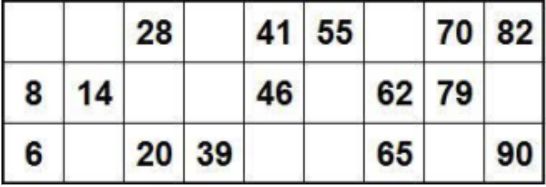

Написать приложение используя React,  которое может отрисовывать карточку для игры в лото.
- Требования к интерфейсу:  
- Внешний вид должен быть аналогичен приложенному изображению  
- Добавить возможность повторной генерации чисел в отрисованной карточке по нажатию кнопки  
- Требования для формирования карточки:  
- Каждая карточка должна содержать уникальный набор чисел от 1 до 90.  
- Всего должно быть 3 ряда и 9 столбцов на каждой карточке.  
- В карточке должны быть заполнены случайным образом 15 чисел (по 5 в каждом ряду) из диапазона от 1 до 90, без повторений в пределах карточки.  
- Каждый столбец должен содержать числа из определенного диапазона: 1-9 для первого столбца, 10-19 для второго и так далее.

